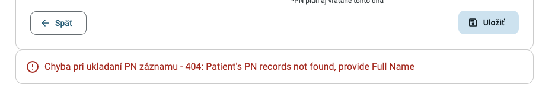
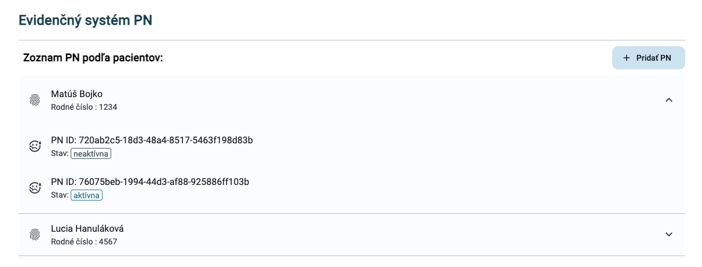
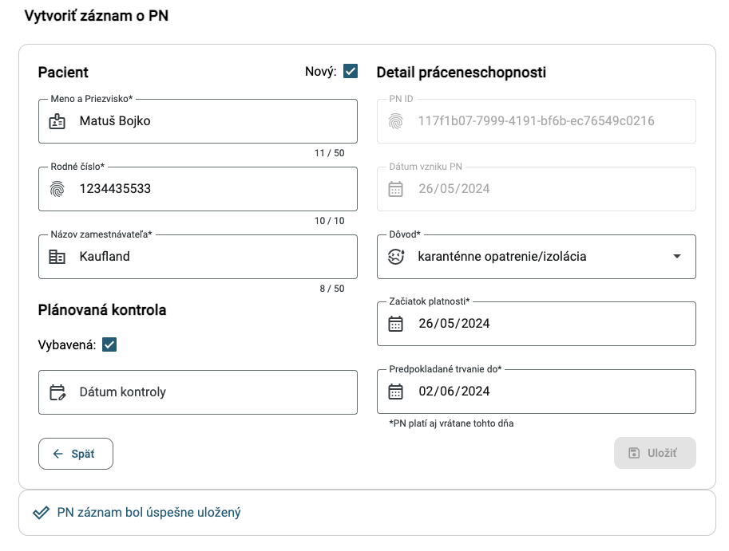
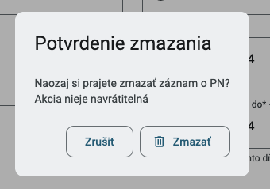

# Evidenčný systém PN

**Autor**: Matúš Bojko

## Stručné informácie k odovzdaniu

Názov aplikácie na spoločnom klastri: Evidenčný systém PN

Link na aplikáciu na spoločnom klastri: https://wac-24.westeurope.cloudapp.azure.com/ui/mb-pnregistry/

Link na web UI nasadený na Azure Cloud: https://mb-pnregistry.azurewebsites.net/

Link na nasadený swagger docs: https://wac-24.westeurope.cloudapp.azure.com/mb-openapi-ui/

Github pre FE: https://github.com/bmathus/pnregistry-ufe

Github pre BE: https://github.com/bmathus/pnregistry-webapi

Github pre GitOps: https://github.com/bmathus/pnregistry-gitops

Linka na Docker Hub registry: https://hub.docker.com/repositories/thamako3

Názov deployment objektu pre UI: mb-pnregistry-ufe-deployment

Názov deploymentu pre webapi: mb-pnregistry-webapi

## Zadanie projektu

**Názov**: Evidenčný a spravovací systém PN (dočasnej práceneschopnosti) pre lekára

**Text zadania**: Ako lekár chcem mať v podobe záznamov prehľad o PN (a ich prislušných údajov), ktoré som vystavil svojim pacientom. Pri vystavení novej PN pacientovi chcem vytvoriť nový záznam (CREATE) a existujúce záznamy chcem vedieť prehľadávať spolu s ich detailmi (READ). Niektoré údaje záznamov môžem upravovať (UPDATE) napr. predpokladané trvanie, v prípade ak sa pacientovi rozhodlo PN predĺžiť. Vytvorené záznamy viem stornovať/odstraňovať napr. v prípade chyby alebo ak sa rozhodnem už staré vymazávať (DELETE).

V tomto projekte pracujeme s 1 typom informácie a to so záznamom o vystavenej PN pre pacienta. Okolo týchto záznamov sme implementovali celý CRUD cyklus:

- GET /records/ - získanie zoznamu všetkých záznamov PN v systéme
- GET /records/{recordId} - získanie konkrétneho záznamu PN podľa jeho ID
- POST /records/ - vytvorenie nového záznamu o PN
- PUT /records/{recordId} - aktualizácia atribútov konkrétneho záznamu PN
- DELETE /records/{recordId} - odstránenie konkrétneho záznamu PN

## PN záznam

PN záznam má nasledujúce atribúty, s ktorými pracujeme, povinné označujeme \*

Poznámka: pri vybraných uvádzame aj validáciu/obmedzenia s nimi spojené, ktoré ošetrujeme a sme implementovali. Tie, ktoré boli možné, sú implementované na FE aj BE (ako validácia polí) a niektoré obmedzenia ako konflikty s existujúcimi záznamami rieši len BE, ktorý odpovedá s chybovou hláškou.

- **id**\* - string - unikátny identifikátor PN záznamu. Na FE automaticky generovaný pri vytváraní nového záznamu
- **patientID**\* (Rodné číslo) - string - unikátne identifikuje pacienta
  - obmedzenia: pre jednoduchosť validujeme len aby obsahoval čislice (0 až 9) a maximálna povolená dĺžka je 10 znakov
- **fullName (Meno a Priezvisko)** - string - celé meno pacienta, na ktorého je PN vystavená. Toto pole je viazané na rodné číslo.

  - obmedzenia: maximálna povolená dĺžka 50 znakov. Pre jednoduchosť pri vytváraní/aktualizácii PN záznamu, toto pole nie je povinné ak na pacienta (jeho RČ) existujú PN záznamy, z ktorých je potom meno na BE získané. V ostatnom prípade systém vyžaduje aby bolo meno poskytnuté alebo vystavená nová PN s daným meno. Ak pri vytváraní PN celé meno poskytneme, systém overuje aby sa zhodovalo s celými menami existujúcich PN záznamov na dané RČ pre udržanie konzistencie medzi nimi.

- **employer**\* (Názov zamestnávateľa) - string - pacientov zamestnávateľ asociovaný s vystavenou PN
  - obmedzenia: maximálny počet znakov 50
- **reason**\* (Dôvod) - string enum - dôvod vystavenia PN

  - obmedzenia: može nadobúdať 6 hodnôt [ choroba, úraz, choroba z povolania, karanténne opatrenie/izolácia, pracovný úraz, iné ]

- **issued**\* (Dátum vzniku PN) - string - dátum vzniku záznamu PN. Na FE automaticky generovaný na dnešný datum pri vytváraní nového záznamu.

  - obmedzenia: musí mať formát dd-mm-rrrr a musí byť v rozsahu dátumov 0001-01-02 a 9999-12-31.

- **validFrom**\* (Začiatok platnosti) - string - dátum od kedy je záznam o vypísanej PN platný.

  - obmedzenia: musí mať formát dd-mm-rrrr a musí byť v rozsahu dátumov 0001-01-02 a 9999-12-31.

- **validUntil**\* (Predpokladané trvanie do) - string - dátum kedy končí platnosť (exspirácia) PN záznamu (vrátane toho dňa).

  - obmedzenia: musí mať formát dd-mm-rrrr a musí byť v rozsahu dátumov 0001-01-02 a 9999-12-31. Dátum musí byť najskôr v deň začiatku platnosti PN alebo neskôr (teda najkratšia povolená je 1 dňová PN).

- **checkUp** - (Dátum kontroly) - string - dátum plánovanej kontroly associovanej s PN.

  - obmedzenia: musí mať formát dd-mm-rrrr a musí byť v rozsahu dátumov 0001-01-02 a 9999-12-31. Dátum musí byť najskôr v deň začiatku platnosti PN alebo neskôr. Tento dátum nie je povinný.

- **checkUpDone** - (Vybavená) - boolean - stav (áno,nie) o tom či kontrola pre danú PN bola vybavená alebo nie. Ak nie je poskytnuté je automaticky vytvorené ako "nie"

Mimo spomenutých veci na FE aj BE je validovaná povinnosť polí a správne typy.

## Riešenie kolízií platnosti PN

V projekte sme ošetrili aby sa viaceré PN záznamy vypísané na jedného pacienta (dané RČ) neprekrývali v zmysle dátumov platnosti (Začiatok a predpokladané trvanie do). Riešili sme to tak, že novú PN na dané RČ je možné vytvoriť len ako najnovšiu z pohľadu platnosti - to znamená, ak najnovšia pacietova PN z hľadiska platnosti expiruje 10/02 tak novú PN je možné mu vytvoriť so začiatkom platnosti najskôr 11/02.

V prípade úpravy existujúcej PN, pre jednoduchosť povoľujeme upravovať len dátumy platnosti tej najnovšej pacientovej PN vzhľadom na dátumy platnosti. Ak existujúcu PN prepíšeme na iného pacienta (iné RČ) systém sa správa pri týchto kolíziách ako pri vytváraní novej PN podľa prvého spomínaného pravidla.

Tieto kolízie rieši BE, ktorý pri vytváraní novej PN alebo úprave existujúcej vracia chybové hlášky, ktoré sa zobrazujú v dolnej karte pod formulárom:

V tejto karte sa zobrazujú všetky chyby od servera. Napr. v prípade spomenutých kolizií platnosti PN to sú:

- Patient already has more up-to-date record or their validity overlap
- Validity dates of not the latest PN record can not be updated

Chybové hlášky, ktoré náš server vracia aj s ich príkladmi máme zdokumentované v Swagger docs.

## Zoznam PN záznamov

Úvodná obrazovka aplikácie zobrazuje zoznam všetkých PN záznamov zoskupených podľa pacientov (rodného čísla). Po kliknutí na konkrétneho pacienta sa rozbalia jeho PN záznamy. Okrem ID záznamu FE zobrazuje aj "stav" PNky, ktorý može byť "aktívna" ak dnešný dátum spadá do rozsahu platnosti PN záznamu (teda do rozsahu Začiatku platnosti a Predpokladaného trvania do). V opačnom prípade je PN záznam označený ako "neaktívna".

Poznámka: pri nasadenej Web appke na spoločnom klastry sa môže diať že novovytvorený PN záznam nepribudne v zozname kvoli striktnému cashovaniu klastra ktorý bol spomínaný na cvičeniach, preto je vždy potrebné vyprazdniť cash stránky a hard reloadnuť stránku.

## Vytvorenie nového záznamu PN

Po kliknutí na tlačidlo "Pridať PN" sa zobrazí formulár na jeho vytvorenie poliami pre všetky spomínané atribúty. Pole "Meno a Priezvisko" je predvolene vypnuté a nie je ho potrebné vypĺňať ak na dané RČ existuje záznam. Ak neexistuje žiadny záznam na RČ (ide akoby o nového pacienta) je potrebné zašktrnúť "Nový" a vyplniť meno. Jednotlivé polia FE validuje pri písaní alebo pri stlačení tlačidla "Uložiť". Po vytvorení (uložení) záznamu sa pod formulárom v spomenutej karte zobrazí správa o úspechu alebo neúspechu, ktoré vracia server.

## Úprava PN záznamu a vymazanie

Pri kliknutí na konkrétny PN záznam v hlavnom zozname sa zobrazí detail daného záznamu v podobe rovnakého formuláru, ktorý je možné obdobne upravovať ako pri vytváraní záznamu. Jeden z rozdielov je v tom, že pole "Meno Priezvisko" sme vypli aby lekár nemusel "triafať" správne Meno Priezvisko pre dané RČ. Po uložení upraveného záznamu sa rovnako zobrazujú validačné správy pod poliami alebo pod formulárom ak je chyba zo servera predovšetkým kvôli konfliktom.

Okrem toho pribudlo tlačidlo pre odstránenie záznamu, pri ktorom sa zobrazuje dialógové okno na potvrdenie. Pri úspešnom zmazaní záznamu sa automaticky vraciame na úvodnú obrazovku celého zoznamu.

## Extra funkcionalita

Ako navyše funkcionalitu môžme považovať vnorený zoznam PN záznamov zozkupený podľa RČ pacientov, ktorý vypočítava či je PN aktívna/neaktívna. Pri načítavaní dát zo servera nad zoznamom PN alebo pod samotným formulárom zobrazujeme načítavací pás tak, aby sa render obsahu nezasekol, kým dáta neprídu zo servera. Okrem toho používame aj navyše materiál komponenty ako napr. check box, spomínaný loading bar, dialógové okno vymazávania záznamov alebo rôzne typy tlačidiel.
